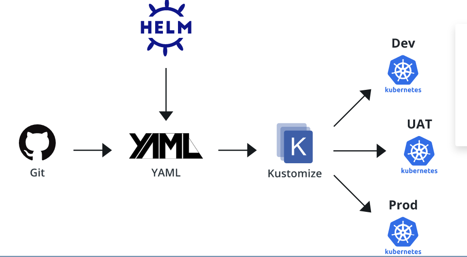
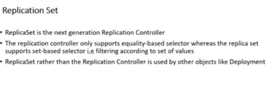
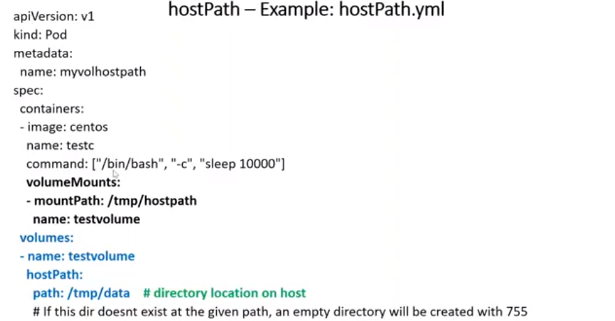
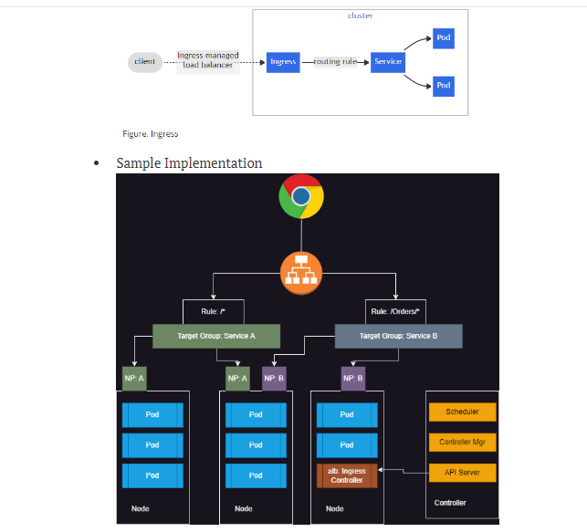

### Kubernetes (K8s)

 is an open source system to deploy, scale, and manage containerized applications anywhere

### container orchistration

#### quoram:
   

   the minimum number of memebers in assembly or society 
        that must be present at any of that meeeting to make the proceding of that meeting valid.
        
         
###         master component

### kubeapi server: 
Handles all the communication of k8s cluster
Let it be internal or external
kube-api server exposes functionality over HTTP(s) protocol and provides REST API

### etcd:
* This is memory of k8s cluster(etcd is stateful means all the information in k8s stored in local)

### sheduler:
* Scheduler is responsible for creating k8s objects and scheduling them on right node

### controller:
* Controller Manger is responsible for maintaining desired state
* This reconcilation loop that checks for desired state and if it mis matches doing the necessary steps is done by controller
    ### node controller
    noiticing and responce when nodes goes down
    ### replication controller
        maintaining correct no. of pods in any replication controller manage
    
    ### endoint controller
    populates the endpoint objects
    

###         node component

### kubelet:

* This is an agent of the control plane

### container run time

* Container technology to be used in k8s cluster
in our case it is docker.

### kube proxy

* This component is responsible for networking for containers on the node

### pod:
smallest unit n k8S

###             Pod lifecycle
K8s Pods will have following states

Pending: creating the pod 

    (1) single container in pod

    (2) multi container in pod 
        maximum we use single container in the pod because multi containers prefer multi applications so we need to scalling only one application pod not supported

Running: starting the pod

Succeded: terminated

Failed: 

###  Container States in k8s pod :

Waiting:

If a container is not in either the Running or Terminated state, it is Waiting. A container in the Waiting state is still running the operations it requires in order to complete start up: for example, pulling the container image from a container image registry, or applying Secret data

Running: 

The Running status indicates that a container is executing without issues. If there was a postStart hook configured, it has already executed and finished.

Terminated:

A container in the Terminated state began execution and then either ran to completion or failed for some reason.

### container policies:

Lets try to create a short lived contianer with different restart policies
    always:
    never:

    onfailure: 
    
exit code => success(0)
exit code => failure(1)

### container: 
three types of containers

###    (1) init container:
            specialized containers that run before app containers in a Pod. Init containers can contain utilities or setup scripts not present in an app image.

###    (2) ephermeral container:
            no guarente containers(debugging)
            Ephemeral containers may be run in an existing pod to perform user-initiated actions such as debugging. This list cannot be specified when creating a pod, and it cannot be modified by updating the pod spec. In order to add an ephemeral container to an existing pod, use the pod's ephemeralcontainers subresource. This field is alpha-level and is only honored by servers that enable the EphemeralContainers feature.

###    (3) application container :
            these are why we write pod spec

###         containers helth check 
         K8s supports 3 kinds of checks

###   (1)liveness probe:
     if this check fails kuberenetes will restart the container.

###   (2)readiness probe:
        if this check fails the pod will be removed from service (pod will not get requests from service)

###   (3)startup probe: 
        This checks for startup and until startup is ok, the other checks will be paused.
 
    
    Probes or checks can be performed by
* exec: run any linux/windows command which returns status/exit code.

* http: we send http request to the application. based on status codes we can decide Refer Here

* grpc: This communicates over grpc

 * tcp: send tcp request

###  replication controller: 
* replication controller depends on labels , these labels are two types 

 ###   (1) equality based:
 (ReplicationController only allows equality based selectors)

    Equality- or inequality-based requirements allow filtering by label keys and values. Matching objects must satisfy all of the specified label constraints, though they may have additional labels as well

  ###  (2) set based:(where as ReplicaSet supports set based selectors also)

    Set-based label requirements allow filtering keys according to a set of values. Three kinds of operators are supported: in,notin and exists (only the key identifier).
    
     For example:

        environment in (production, qa)
        tier notin (frontend, backend)

* ### for communication of nodes we use (services)


*   K8s as a service basically means the master nodes will be managed by cloud provider


* Cluster ip:
 internal communication

* Node Port:
   k8s will expose the application on a port on every node in k8s cluster.

* LoadBalancer:
 This is generally used with managed k8s clusters

 

* external:( C- name DNS)

## deployment

### (1) canary:
      new and old versions are in container , but we have monitoring service  on new version incase new version is working accuratly all old version pods are kill and only new version  pods create orderly

      (release a new version to a subset of users, then proceed to a full rollout)

### (2) recreate
:terminate the old version and release the new one

### (3) ramped: 
 for very older applications ; release a new version on a rolling update fashion, one after the other 

### (4) blue/green:
 release a new version alongside the old version then switch traffic

### (5) A/B  testing:
release a new version to a subset of users in a precise way (HTTP headers, cookie, weight, etc.). A/B testing is really a technique for making business decisions based on statistics but we will briefly describe the process


### (6) roolback and rool out: 
anycomplexities on new version pod takes old version  is called roolback
new versiom is called roolout

### taint & affiniti

pods assigned to the nodes by using sheduler its checks spu,memory,ram ...... some env variables of nodes and pods is called affinity
 * affinity are two types those are
                                 (1)pod affinity
                                 (2)node affinity
  * taint is opposite of affinity
    means you want to remove (repulse) pods to node is called taint

----------------------------
### Kubernetes api versioning

* To k8s cluster we directly or indirectly using kubectl speak with API Server

* k8s has lot of features underdevelopment, stable, improvements

    There are 3 channels for objects/features

        alpha : have create community ; for ex: cloude native k8s there might be change in API gateway also but it don't use in production

        beta : after alpha we did not remove that changes in this beta stage , and small changes will occures 

        stable : all features within the API group is specified in a REST path and in the api version serialized object.

    *  Every thing in k8s is an object.
        To declare an object, we need to specify 4 fields

    * kind is type of object

    * metadata describes some additional information about object you are trying to create (name, labels)

    * spec: This is the desired state

    * To get all the api-resources in your k8s cluster (kubectl api-resources)

### helm (old version tinnel)
    disadv: basically 
    *  helm is a package manager for k8s (like apt is package manager for ununtu)

  * helm is to run dynamic yaml files(ex: echo "hema" = static)
        ( name=hema ; echo 'welcome $name' = dynamic )
    # new loadbalancer in every service is a  not good because it is very cost
    good idea is(ingress controller: controller is third party) use reusable loadbalances or lb work on layer 4 (port and tcp)

    /catalog
    /log
    /identity.qt.com
    no need it we need http/ adress name
    we need layer 7 (path based / hostname based)

      my company "f5" load balancer big hardware service load balancer

### kustamize 

kustamize is nothing but module

* kustamise also a dynamical yaml approch , it's override approch , kustamize nativelly supports kubectl (latest versions)

 kustumize adv is we directly run from git environment 
 
 # kubectl apply -k .     (means  kustomize directory)

## interview (q)

helm is package manager in k8s
y u use this helm
 helm chat is very easy to deploy by using (helm install<nameof application>)

        helm install [chat] [wr chat present] []

### patching
 patching means changing
 i have a  patch for service 
 type will be change in port
 type will be change in loadbalanceer
------------------------------
build image code
terraform apply

kms(aws)
key valut (azure)
hashi crop vault


most common failures in k8s
-----------------------------------------------------------------------
### deamon set
*  we want to attach pod to every node beacause of metrics , logs , and monitoring , fileagent purpose 
* DaemonSet is a controller which creates pod on every/selected nodes in k8s cluster
Use cases:
   *  log collectors
   *  agents etc


### affinity/anti affinity:
* Schedule a Pod using preferred node affinity

*  how to assign a Kubernetes Pod to a particular node using Node Affinity in a Kubernetes cluster.

        kubectl get nodes --show-labels
* nodeAffinity: Describes node affinity scheduling rules for the pod.

* podAffinity: Describes pod affinity scheduling rules (e.g. co-locate this pod in the same node, zone, etc. as some other pod(s)).

* podAntiAffinity: Describes pod anti-affinity scheduling rules (e.g. avoid putting this pod in the same node, zone, etc. as some other pod(s))

### taint and tolarasions:
taint is cannot assigning(con't working) pods in perticular node 

 taint is node level
 tolaration is pod level

 #### noshedule: 
 already executed pods will be running . but new pods can't attached
 #### prefer noshedule:
 which must be of effect NoExecute, otherwise this field is ignored
 #### evict(no execute):
 delete all the pods previously created in the node 


    kubectl taint nodes node1 key1=value1:NoSchedule

### node selector

When we have tried to create a pod with nodeSelector matching purpose: poc it was created on node 0 and when we created a pod with purpose:
 testing it created in node 1 and when created a pod with purpose: 
 development it was in pending state (not created)

* ### service:
* services are two types 
(1)internal service : cluster ip
(2)external service : node port , load balancer

* When upgrading to newer versions of Pods ensure right set of labels are present on k8s service selector


### headless services:
 * Headless service will not have cluster ip
 * Headless service returns the ips of the pods returned by selector.
 * This is used in stateful sets

 ### stateful set: 

 Statefulset is like deployment with replicas. But each pod gets its own volume.
 When we create replicas in Stateful Set we get predictable names
  We can access individual pod, by creating headless service and by using ...svc.cluster.local
 


  load balancer sends traffic into main pod after that creating pod pods maintainerssame data in mainpod copied into the remaining pods .

 ### stateless service:

 load balancer send traffic into the  differend pods wich one have less traffic deals

 ### volumes

 Volume represents a named volume in a pod that may be accessed by any container in the pod.

  it is temporarystorage we delete pod storage of data(information) also deleted

  ### ephermal volume:
 ### config:
 ### secret: 
  ### ephermal:
  ### persisted: 
  when we delete  pods then data also deleted 

  persisted volumes have storage clasess
  these storage classes are used for communicate with cluster storages (in aws ecs)


  # ADOM K8S

  
  
  
  
  
  
  
  
  
  
  
  
  
  
  
  
  
  
  
  
  
  
  
  
  
  
  
  
  
  
  

  * PERSISTENT VOLUME (static volume persistence)
    * because we previously create one volume(EBS)   in  aws cloud

   create one object in ur k8s cluster , in cloud you need to create storage in aws , map that storage into k8s cluster is called prsistent volume. 

    
   
   


* persistance volume claim: which  is available to match that's the persistent volume


* persistent volume provisioning


 ### health check

 * application in running but its not working properly we need health check
 
 


## k8s config & secrete
* k8s me wil write one config file it reads the file and will be store it on a vertual memory , which will come inside the pod.

* The file in which you are sharing some content  which needs to be availabe inside the container  ifthis file containes application detailes file , the file which have configuration details (db details, ) i called configuration map

* the file can have sensitive data is called secrets . 
* content of ur container you don't have content of the file access it as a environment variable in container .


```yaml

apiVersion: v1
kind: PersistentVolume
metadata:
  name: my-pv
spec:
  capacity:
    storage: 2Gi
  accessModes: 
    - ReadWriteOnce
  persistentVolumeReclaimPolicy: Recycle 
  awsElasticBlockStore:
    volumeID: <instance volume id>
    fsType: ext4
    
    
```
```yaml
apiVersion: v1
kind: PersistentVolumeClaim
metadata:
  name: pvc-utilizes
spec:
  accessModes:
    - ReadWriteOnce
  resources:
    requests:
      storage: 1Gi

```
* 
  ## KOPS INSTALLATION 

  * kops means k8s operations , kops is a free and open source command line tool for configuring and maintaining k8s clusters and provisioning the cloud infrastructure needed to maintain them . kops is officially supported and widely used on aws , and is expanding to support multiple additional cloud platforms.

  #### kops prerequisites 

  (1) aws account

  (2) deploy or create one management server which holds all scripts

  (3) s3 bucket

  (4) route 53 domain integration 

  (5) kops binary and kubectl binary

  (6) ssh public and private key

  (7) aws access key and secret key (aws cli for configuring)

  #### kops installation
  * create one ec2 instance
  * <https://github.com/kubernetes/kops/releases/download/v1.27.0/kops-linux-amd64>
  * chmod 700 kops-linux-amd64
  * mv kops-linux-amd64 kops
  * mv kops /usr/local/bin/
  * kops version
  * <curl -O https://s3.us-west-2.amazonaws.com/amazon-eks/1.27.1/2023-04-19/bin/linux/amd64/kubectl>
  * chmod 700 kubectl
  * mv  kubectl /usr/local/bin/
  * ssh-keygen
  * awscli installation and configuration
  * kops create cluster --name=<our choice> --state=<bucketname> --zones=<namezone> --node-count=<number> --node-size=<t2....> --master-size=<t2..> --master-volume-size=<our choice> --node-volume-size=<> --dns-zone=<DNS name>

  * kops create cluster --name=sohail666.xyz --state=s3://sohail666.xyz --zones=us-east-1a --node-count=1 --node-size=t2.medium --master-size=t2.medium --master-volume-size 20 --node-volume-size 10 --dns-zone=sohail666.xyz
  *kops get ig
   *   kops get ig --state=s3://chaitu.xyz --name=babool.xyz
   *  kops edit ig <control-plane-ap-south-1a> --state=s3://chaitu.xyz
   *  kops edit ig nodes-ap-south-1a --state=s3://chaitu.xyz
   *  kops update cluster --state=s3://chaitu.xyz --yes 
   * kops update cluster  --name=<our choice> --state=<bucketname> --yes
   * kops get cluster --state=<statefilename(bucket name)>
   * kops delete cluster --state=<statefile> --name=<clustername> --yes
  


  


  ### kube spray 
  * kubespray is a composition of ansibe playbooks , inventory , provisioning tools and domain knowledge for generic OS or k8s clusters configuration management tasks 

  ### k8s errors:

  ##  (1) image pull backoff , ErrImagePull
   
   * wrong container image (path by mistake)
   * trying to use private images with out providing regstry credentials (like ecr with out credentials )
   * image does not exists

## (2) crashloop back off
   
   * in single pod  multiple containers are presented , in that two containers have running application in same port (httpd , nginx) then crash loop backoff error will be occures

   * when you are launching a new application on k8s having the application crash on startup is a common occurence .
   * we can see that application exit code is 1 , we might also see an OOMKilled error (first thing we can do is check our application logs (kubectl logs <pod name>))

## (3)  run container error

     * Missing ConfigMap or Secret

     * Kubernetes best practices recommend passing application run-time configuration via ConfigMaps or Secrets. This data could include database credentials, API endpoints, or other configuration flags.

    * A common mistake that I've seen developers make is to create Deployments that reference properties of ConfigMaps or Secrets that don't exist or even non-existent ConfigMaps/Secrets. 
## (4)  if we  are unable to  delete pods for any reason

   *  for every pod  we have some finalizers , so we should un-comment  and then delete the pod .


  ### KUBERNETES

  * kubectl create job  <job name> --image=<image name>

  * kubectl get po

  * kubectl exec -it <pod name> -- /bin/bash

      apt update && apt install net-tols -y
      ifconfig

  * kubectl create job alpine --image=alpine -- sleep -- 1d

## sidecar - container 

* Sometimes we might need extra functionality to inject log exports, network monitoring, tracing, then we can add one more container as side car in your pod

(1) Write a Manifest for a Pod which runs two containers
name is first & image is alpine sleep 1d
name is second & image is ubuntu sleep 1d

*   kubectl exec -it -c <container name> <podname> -- /bin/sh

      #### docker container run --name <identifying name> -d -P <image name>

      #### docker container logs <identifying name>

      ####  docker container run --name <identifyingname> -P -d --cpus="1" --memory 512m <image-name>

### container states in a pod

  * running
  * terminated
  * waiting
### pod states in job

  * pending
  * runnng
  * succeded
  * failed
  * unknown
###  Labels && annotations

* kubectl run frontend --image=httpd --restart=Never --labels=env=prod,team=admin

* kubectl run backend --image=httpd --restart=Never --labels=env=prod,app=apache

* kubectl run database --image=httpd --restart=Never --labels=env=prod

* kubectl get po --show-labels

* kubectl describe pods 

*  kubectl label pods backend env-

*  kubectl get pods --show-labels

* kubectl get pods -l 'team in (admin)',env=prod --show-labels

* apt update && apt install tmux -y


### RBAC (ROLL BASED ACCESS CONTROLE)

*  kubectl auth can-i -h (or) --help

* in k8s we give permissions for NODE authentication , ABAC , RBAC & web hook autharization (permisssions or autheraizations are applicable for users , groups , service account)

* we give access to the team members for operating access . (delete, create , update , patch , list , get ....) this are called VERBS

* above operations applicable for resources (configmaps , pods , secretes , deployment , PV and pvc ....)

* kubectl api-resources

* kubectl create job --image:caddy >> job.yaml

* kubectl create namespace <name> >> ns.yaml

* kubectl get ns

* kubectl congif set-context --current --namespace=<new-namespace>

* kubectl get role

* kubectl get rolebinding

*  mkdir cert

* cd cert

* openssl genrsa -out <name>.key <size> ## size like 2048 ,1024

* openssl req -new -key <name>.key -out <name>.csr -subj "/CN=<name>/O=learning"

* openssl x509 -req -in <name>.csr -CA /etc/kubernetes/pki/ca.crt -CAkey /etc/kubernetes/pki/ca.key -CAcreateserial -out <name>.crt -days 120

* kubectl config set-credentials <name> --client-certificate=<name>.crt --client-key=<name>.key

* kubectl config set-context <name>-context --cluster=kubernetes --user=<hema>

* kubectl config use-context <name>-context

### create one service account 
apiVersion: v1
kind: ServiceAccount
metadata:
  name: robo
automountServiceAccountToken: true

### attach service account to pod
```yaml

---
apiVersion: v1
kind: Pod
metadata:
  name: robotrails
spec:
  serviceAccountName: robo
  containers:
    - name: nginx
      image: nginx
### create a role name as foramlity

---
apiVersion: rbac.authorization.k8s.io/v1
kind: Role
metadata:
  name: formality
rules:
  - apiGroups:
      - ""
    resources:
      - pods
      - services
    verbs:
      - list
      - get
      - watch
  - apiGroups:
      - apps
    resources:
      - deployments
    verbs:
      - list
      - get
      - watch
```

### create a role binding 

```yaml
apiVersion: rbac.authorization.k8s.io/v1
kind: RoleBinding
metadata:
  name: formality-rolebinding
roleRef:
  apiGroup: rbac.authorization.k8s.io
  kind: Role
  name: formality
subjects:
  - apiGroup: rbac.authorization.k8s.io
    kind: User
    name: <name>
  - kind: ServiceAccount
    name: robo
```

### Role and RoleBindings apply to a particular namespace

### commands to upgrate kubernetes version from old version to new version


 ## commands to update controle plane

      sudo apt-mark unhold kubelet kubeadm kubectl
      curl -fsSL https://pkgs.k8s.io/core:/stable:/v1.27/deb/Release.key | sudo gpg --dearmor -o /etc/apt/keyrings/kubernetes-apt-keyring.gpg
      echo 'deb [signed-by=/etc/apt/keyrings/kubernetes-apt-keyring.gpg] https://pkgs.k8s.io/core:/stable:/v1.27/deb/ /' | sudo tee /etc/apt/sources.list.d/kubernetes.list
      sudo apt-get update
      sudo apt-cache madison kubeadm
      sudo apt-get install kubeadm=1.27.4-1.1 && sudo apt-mark hold kubeadm
      kubeadm version
      sudo kubeadm upgrade plan
      sudo kubeadm upgrade apply v1.27.4
      kubectl drain ip-172-31-33-86 --ignore-daemonsets
      sudo apt-m  ark unhold kubelet kubectl && sudo apt-get install -y kubelet=1.27.4-1.1 kubectl=1.27.4-1.1 && sudo apt-mark hold kubelet kubectl
      sudo systemctl daemon-reload
      sudo systemctl restart kubelet.service
      kubectl uncordon ip-172-31-33-86
      kubectl get nodes


## commands to update worker node 


    curl -fsSL https://pkgs.k8s.io/core:/stable:/v1.27/deb/Release.key | sudo gpg --dearmor -o /etc/apt/keyrings/kubernetes-apt-keyring.gpg
    echo 'deb [signed-by=/etc/apt/keyrings/kubernetes-apt-keyring.gpg] https://pkgs.k8s.io/core:/stable:/v1.27/deb/ /' | sudo tee /etc/apt/sources.list.d/kubernetes.list
    sudo apt-get update
    sudo apt-mark unhold kubelet kubeadm kubectl
    sudo apt-cache madison kubeadm
    sudo apt-get install kubeadm=1.27.4-1.1 && sudo apt-mark hold kubeadm
    sudo kubeadm upgrade node
    kubectl get nodes
    kubectl drain ip-172-31-40-43 --ignore-daemonsets
    sudo apt-mark unhold kubelet kubectl && sudo apt-get install -y kubelet=1.27.4-1.1 kubectl=1.27.4-1.1 && sudo apt-mark hold kubelet kubectl
    sudo systemctl daemon-reload
    sudo systemctl restart kubelet.service
    kubectl uncordon ip-172-31-40-43


## NAMESPACE

  * namespace are a way to organize cluster into vertual sub-clusters

  * kubectl create namespace <name>

  * kubectl get --all -namespaces

  * kubectl get pods -n <name-of-namespace>

  * kubens <namespace-name>

  * kubectl delete pods --all -n <name-of-ns>

  * kubectl config set-context --current --namespace=<name-of-ns>

          current-context   Display the current-context

      delete-cluster    Delete the specified cluster from the kubeconfig

      delete-context    Delete the specified context from the kubeconfig

      delete-user       Delete the specified user from the kubeconfig

      get-clusters      Display clusters defined in the kubeconfig

      get-contexts      Describe one or many contexts

      get-users         Display users defined in the kubeconfig

      rename-context    Rename a context from the kubeconfig file

      set               Set an individual value in a kubeconfig file

      set-cluster       Set a cluster entry in kubeconfig

      set-context       Set a context entry in kubeconfig

      set-credentials   Set a user entry in kubeconfig

      unset             Unset an individual value in a kubeconfig file

      use-context       Set the current-context in a kubeconfig file
      
      view              Display merged kubeconfig settings or a specified kubeconfig file
      
### CNI:

*  K8s dictates the following requirements

    All Pods must communicate with each other without NAT

    Nodes can communicate with Pods without NAT

    Pod ip address is same as those outside the Pods that it sees itself

* With the above constraints we have 4 distinct network problems 

    Container to Container networking

    Pod to Pod Networking

    Pod to Service Networking

    Internet to Service Networking

* (1) container to container networking 

      two pods inside the containers shares the same network  namespace

      * create 2 containers in the one pod and give the names for each containers 
      
      * kubectl apply -f <name.yaml>

      * kubectl get po -owide

      * kubectl exec -it <podname> -c <contkubectl exec -it mypod -c container1 -- /bin/bash ainer1-name> -- /bin/bash

      * kubectl get pods mypod -o=jsonpath='{range .status.podIP}{"Container 1 IP: "}{@}{"\n"}{end}'

      * kubectl exec -it <poname> -c <container1-name> -- /bin/sh

      * curl http://<podip>:<port-of container 2>

### pod to pod communication with in the same node

* kubectl create job <jobname> --image:<image name>

* kubectl get po -owide

* kubectl exec -it <pod-1 name> -- /bin/sh

    * cat /etc/os-release

    * apk update && apk add curl && apk add net-tools

    * ping http://<pod2-ip>:<port> (or) curl http://<pod2-ip>:<port>

### pod to pod communicaion with in same node but different namespaces 

 * 

### pod to pod communication within the different nodes

* service mechanisum who as access the applications inside the pod/containers


* kubectl get deploy --all-namespaces

* kubectl get pods --all-namespaces

*  kubectl get deploy --all-namespaces

*  kubectl get deployment.apps -n kube-system coredns -o yaml > deploy.yaml

*  kubectl get svc --all-namespaces


```yaml
apiVersion: apps/v1
kind: Deployment
metadata:
  name: nginx-deployment
spec:
  selector:
    matchLabels:
      app: nginx
  replicas: 2
  template:
    metadata:
      labels:
        app: nginx
    spec:
      containers:
      - name: nginx
        image: nginx:1.14.2
        ports:
        - containerPort: 80
---
apiVersion: v1
kind: Service
metadata:
  name: nginx-svc
spec:
  selector:
    app: nginx
  ports:
    - name: nginx-svc
      protocol: TCP
      port: 80
```

* kubectl get svc --all-namespaces

* kubectl get endpoints

* kubectl get endpointslices.discovery.k8s.io


##### Endpoints help identify what pods are running for the service, Endpoints are created and managed by services

```yaml
apiVersion: v1
kind: Endpoints
metadata:
  name: nginx-svc
subsets:
- addresses:
  - ip: 192.168.0.8
    nodeName: controlplane
    targetRef:
      kind: Pod
      name: nginx-deployment-cbdccf466-6q5f9
      namespace: default
      uid: 9e2da211-7213-40de-921f-7e871690fcac
  - ip: 192.168.0.9
    nodeName: node01
    targetRef:
      kind: Pod
      name: nginx-deployment-cbdccf466-kxc47
      namespace: default
      uid: 69ea9d52-94fa-4bb9-8650-cddefeb947e8
  ports:
  - name: nginx-svc
    port: 80
    protocol: TCP
```

*  kubectl apply -f endpoint.yaml

### There are four types of services


#### ClusterIP : 

    two pods present in two diffenent nodes for internanally they communicate with each other by using clusteIP 

    cluster ip is used expose internal communicatin purpose , which means with in the k8s cluster you wolud be able to access the pods

* kubectl get svc

* kubectl port-forward service/api-svc 8080:8080

* curl <ipv4>:8080


#### NodePort:

* incase you have 10 worker nodes , in 10 nodes same applicaiton will be run in the 10 worker nodes the ips will be different , then we will access the single applications with 10 different ip adresses .


* node-port type expose to your pod to external network  with the same target port, user can access it using the worker node ip and port  will you exposes.

* user will be access traffic will be send to the respective pods  pods to the service .

* kubectl get svc

* kubectl get pods -owide

* same application runs on two nodes based on node labels

* 
  
    
#### LoadBalancer

* one single ip given to acess the application , we prefer LoadBalancer . the application access out side the cluster also

* but loadbalancer type that will work only in the cloud provider . 

* if in the k8s cluster environment that hosted down any cloud provider like ruby cloud or aws  . then you be able to use the loadbalancer you would get external ip to the load balancer , 


*  external ip in the Load balancer is chargable

#### ExternalName


## INGRESS(ingress controller+ingress)

* Ingress is k8s specific Layer & HTTP Load Balancer which is accesible
externally 

* out side traffic go to the ingress controller , we have must and should we have ingress config file . then after  it redirect to the traffic .

* 




### Deployment files

```yaml
apiVersion: apps/v1 
kind: Deployment
metadata:
  name: catalog
  labels:
    app: nginx
    env: uat
spec:
  minReadySeconds: 5
  replicas: 2
  strategy:
    type: RollingUpdate
    rollingUpdate:
      maxSurge: 25%
      maxUnavailable: 25%
  selector:
    matchExpressions:
      - key: online 
        operator: In
        values:
          - flipkart
          - amazon
  template:
    metadata:
      labels:
        online: amazon
    spec:
      containers:
        - name: catalog
          image: hema789/ingress:catalog
          imagePullPolicy: IfNotPresent
          ports: 
            - containerPort: 80
              
---
apiVersion: v1                 
kind: Service
metadata:
  name: catalog-svc
spec:
  type: ClusterIp
  selector: 
    online: amazon
  ports:
    - port: 80
      protocol: TCP

---
apiVersion: apps/v1 
kind: Deployment
metadata:
  name: identity
  labels:
    app: nginx
    env: uat
spec:
  minReadySeconds: 5
  replicas: 2
  strategy:
    type: RollingUpdate
    rollingUpdate:
      maxSurge: 25%
      maxUnavailable: 25%
  selector:
    matchExpressions:
      - key: online 
        operator: In
        values:
          - flipkart
          - meesho
  template:
    metadata:
      name: identity
      labels:
        online: meesho
    spec:
      containers:
        - name: identity
          image: hema789/ingress:identity
          ports: 
            - containerPort: 80
              protocol: TCP
---
apiVersion: v1
kind: Service
metadata:
  name: identity-svc
spec:
  type: LoadBalancer
  selector: 
    online: meesho
  ports:
    - port: 80
      protocol: TCP
---
apiVersion: apps/v1 
kind: Deployment
metadata:
  name: bascket
  labels:
    app: nginx
    env: uat
spec:
  minReadySeconds: 5
  replicas: 2
  strategy:
    type: RollingUpdate
    rollingUpdate:
      maxSurge: 25%
      maxUnavailable: 25%
  selector:
    matchExpressions:
      - key: online 
        operator: In
        values:
          - bascket
          - amazon
  template:
    metadata:
      name: bascket
      labels:
        online: bascket
    spec:
      containers:
        - name: catalog
          image: hema789/ingress:bascket
          ports: 
            - containerPort: 80
              protocol: TCP
---
apiVersion: v1
kind: Service
metadata:
  name: bascket-svc
spec:
  type: clusterIp
  selector: 
    online: bascket
  ports:
    - port: 80
      protocol: TCP
---
apiVersion: networking.k8s.io/v1
kind: Ingress
metadata:
  name: minimal-ingress
  annotations:
    nginx.ingress.kubernetes.io/use-regex: "true"
    nginx.ingress.kubernetes.io/rewrite-target: /$
spec:
  ingressClassName: nginx
  rules:
    - http: 
        paths:
          - path: /catalog(/|$)(.*)
            pathType: Prefix
            backend:
              service: 
                name: catalog-svc
                port:
                  number: 80
    - http: 
        paths:
          - path: /bascket(/|$)(.*)
            pathType: Prefix
            backend:
              service: 
                name: bascket-svc
                port:
                  number: 80
    - http: 
        paths:
          - path: /identity(/|$)(.*)
            pathType: Prefix
            backend:
              service: 
                name: identity-svc
                port:
                  number: 80
```
kubectl apply -f <ingress.yaml>
kubectl apply -f <ingress.yaml>
kubectl describe ingress <ingress_name>
kubectl describe ingress <ingress_name>
kubectl edit ingress <ingress_name>
kubectl get ingress <ingress_name> -o yaml

kubectl logs <ingress_controller_pod_name>


## ETCD

* We can setup HA Cluster using two topologies

  (1) stacked etcd : The distributed data storage (etcd) is part of nodes managed by kubeadm

  (2) external etcd : 

  *  This HA Cluster will have external etc where the data is distributed and stored
  * Each control plane node has kube-apiserver, kube-scheduler, kube controller manager
  * This is more HA and it needs minimum six nodes to setup master

* Efficient Terminal Management: 

      apt update && apt install tmux -y

    Tmux allows you to manage multiple terminal sessions within a single window, enabling you to work on several tasks simultaneously or switch between tasks quickly.

*  ctrl + b , : rename window
* cntl + b % : create vertical split
* cntl + b " : create horizantal split

### RBACK 
     raback mainly containes 3 types 

##### (1) subject: 
          
          user
          group
          service account : Service Account is an user account for non human (like AWS roles)
          * Whenever we create a namespace a service account called as default is 
          
      kubectl get sa
      kubectl get secrets
      kubectl create ns <namespace-name>
      kubectl config get-context --current namespace=<namespace-name>
      kubectl create sa <service-account-name>
      kubectl get sa
      kubectl get secrets
      cd sa
      ls -lrt
```yaml
apiVersion: v1
kind: Pod
metadata:
  name: test-pod
  labels:
    app: test-pod
spec: 
  serviceAccount: hemasa
  containers:
    - name: hema
      image: nginx
      ports:
        - containerPort: 80 
---
apiVersion: v1
kind: Service
metadata:
  name: pod-svc
spec:
  type: ClusterIP
  ports:
    - targetPort: 32000
      port: 80

```

##### (2) API resources: 
##### (3) operations 

inside pod you will run the below commands
   * kubectl get no

   * kubectl get po -owide

   * kubectl create namespace <name-of-ns>

   * kubectl get ns

   * kubectl get serviceaccount -n <name-of-ns>

   * APISERVER=https://kubernetes.default.svc
SERVICEACCOUNT_DIR=/var/run/secrets/kubernetes.io/serviceaccount
TOKEN=$(cat ${SERVICEACCOUNT_DIR}/token)
CACERT=${SERVICEACCOUNT_DIR}/ca.crt
curl --cacert ${CACERT} --header "Authorization: Bearer ${TOKEN}" -X GET ${APISERVER}/api/v1/namespaces/default/pods


   * kubectl create serviceaccount <service-name>

   * kubectl create rolebinding qtsa-readonly \
    --clusterrole view \
    --serviceaccount=default:qtsa \
    --namespace=default
  
  * goto default namespace 

  * kubectl config get-context --current --namespace=default

  * create one service account 


  * create one pod

  * kubectl get po -owide

  * kubectl exec -it <pod-name> -- /bin/sh

  * create kube-api server using below script or commands

  *  APISERVER=https://kubernetes.default.svc
SERVICEACCOUNT_DIR=/var/run/secrets/kubernetes.io/serviceaccount
TOKEN=$(cat ${SERVICEACCOUNT_DIR}/token)
CACERT=${SERVICEACCOUNT_DIR}/ca.crt
curl --cacert ${CACERT} --header "Authorization: Bearer ${TOKEN}" -X GET ${APISERVER}/api/v1/namespaces/default/pods


## RBAC


* kubectl auth can-i --list ---as="system:serviceaccount:<namespace>:<service-account-name>"

* 


### REPLICA SET AND CONTROLLER

* replicaset is advanced version of replicatn controller its supports both equality (= , !=) and set based (expression like : In , Notin )

* kubectl create namespace <name>

* kubectl config set-context --current --namespace=<name>

* kubectl get nodes -owide

* kubectl get pods -owide

* kubectl cordon <node-name>

* kubectl drain --ignore-daemonsets <nodename>


* kubectl uncordon <nodename>

* kubectl get nodes 


### resourcequatos and limits

* inside the namespace we have allocates some memory  , any pods share with these memory only . then suddendly our cpu is exceeded at that time pod cannot in running state

* to overcame that issue we mentions the limits of namespaces in resourcequatos and limits

* We need to put restriction on namespace to restrict how many pvc claims, loadbalancers, nodeports

```yaml
---
apiVersion: v1
kind: ResourceQuota
metadata:
  name: activity-quota
spec:
  hard:
    services: "2"
    pods: "10"
    services.nodeports: "2"
```

## Scheduling and Tooling

* K8s Cluster can contain multiple nodes and workloads are scheduled on the node by kube-schedule and there are different factors influencing the decision to select the node

(1) node selector

(2) node affinity

(3) taints and tolerations

* Container Resource Limits influence this decision as kube-Scheduler will sum all the requests of container in a Pod spec and schedules it on a suitable node

* If the Pod doesnot schedule due to insufficient resources available on nodes in the Events we will see the following reasons

  PodExceedsFreeCpu

  PodExceedsFreeMemory

###  Node-Selector ( labels will be mathing then only on that labeld nodes pods will be sheduled)

* kubectl get nodes

* kubectl get nodes --show-labels

* kubectl label node <nodename> <key>=<value> --overwrite 

* above command is used to change the node volues (or) labels


```yaml
---
apiVersion: v1
kind: Pod
metadata:
  name: matching
spec:
  nodeSelector:
    diskspeed: high    ## we apply labels in *  kubectl get no --show-labels values here 

  containers:
    - name: mycontainer
      image: nginx
```
###  Affinity


```yaml
apiVersion: v1
kind: Pod
metadata:
  name: matching
spec:
  activeDeadlineSeconds: 5
  affinity:
    nodeAffinity:    ### for this option we have anoter option we select "preferance" also for soft and hard
      requiredDuringSchedulingIgnoredDuringExecution:
        nodeSelectorTerms:
          - matchExpressions:      ## these key and values are taken from "kubectl get nodes --show-labels"
              - key: diskspeed
                operator: In
                values: 
                  - low
                  - high 
  containers:
    - name: hema
      image: caddy
      ports:
        - containerPort: 80
```


### TAINT AND TOLERATION

* taint is a property of node to repel the pods.

* if you want to attach the pods 

* taint used in Dedicated Hardware & evictions 

* tainet effects is 

    noSheduled
    noExecute
    preferNoShedule

* kubectl --help

* kubectl taint --help

* kubectl tainet nodes <nodename> <taintkey>:<taintvalue>:<tainteffect>

* yq --help (this yq is used to modifydata in yaml files)

### Problems or challenges CI/CD pipeline of k8s

* Consider a normal CI/CD pipeline where the builds are triggered once in a day (nightly builds) and we need to create 3 environments. but our manifest file is same for all envs so we can use 

(1)helm
(2) kustomize


### helm
 
 * if you consider k8s as Operating System  helm is a package manager for k8s .

      curl -fsSL -o get_helm.sh https://raw.githubusercontent.com/helm/helm/main/scripts/get-helm-3

      chmod 700 get_helm.sh

      ./get_helm.sh


    
    https://github.com/arttor/helmify/releases/download/v0.4.11/helmify_Linux_arm64.tar.gz

    sudo tar -xvzf helmify_0.4.3_Linux_64-bit.tar.gz

    sudo cp helmify /usr/bin/

    helmify --version

    helm has 3 files they are

    1. templet.yaml
    2. values.yaml
    3. output.yaml


### kustomize

* Kustomize is a solution that creates k8s components by overlaying declarative yaml artifacts without changing actual files


   #### funtionality

* template : helm have teplate but kuzomize no need to the template

* setup: helm needs some setup , kustomize don't need any setup

* configuration: helm and kustomize both  manages multipe configurations with one base file.


### NETWORKING

* to access the application inside the pod is called service .

* pod is nothing but have application on top of container 

* pod will be created we get one some ip address for each od

* this pods will be managed by deployment , thes deployment managed by service . the service connect to the service based  on lables ..

*  ingress service exposess the http & https applications only 

*  incase two applications are running in multi tanent cluster , with three differant namespaces .

* kubectl -n <1-namespace> exec <in-1-ns-podname> --curl <pod ip>

* kubectl describe namespace <namespace-name>

* kubectl config view --minify --output 'jsonpath={..namespace}'


```yaml
apiVersion: networking.k8s.io/v1
kind: NetworkPolicy
metadata:
  name: apptodb
spec:
  podSelector:
    matchLabels:
      tier: db
  ingress:
    - from:
        - podSelector:
            matchLabels:
              tier: app
      ports:
        - port: 80
          protocol: TCP
```


* By default all the pods in k8s are open for communication. Network policy is k8s impementation of network firewalls. 

* network policy it will controle the traffic between the pods.

* Network policy’s bring this, we can build ingress/egress rules based on
    
    CIDR Blocks

    Pod’s Label selectors

    namespaces

* Network Policy is part of CNI’s implementation and not all CNI plugins support Network policy, some of the popular CNI plugins which implement network policy are

    Calico

    Cilium

    Kube-router

    Weave net

* All managed providers give us the option either by default or by add-ons the feature of Network policy .

[linkfor trouble shooting](https://directdevops.blog/2023/10/03/completek8s-classroomnotes-03-oct-2023/)

###  AKS OR EKS 

* controlle plane is maintained by cloud . for the nodes pay the bills as you pay for normal vm.

* worker nodes can be scalled automatically

### Features:

* Identity and Security Management

* Kubernetes RBAC: AKS supports native K8s RBAC

* Azure AD: AKS can be configured with Azure AD

* Integrated Logging and monitoring

* Container insights feature in Azure Monitor can be addon to the AKS cluster
Azure Monitor managed service for Prometheus

  * Cluster node and pod scaling

* Cluster autoscaler for scaling nodes and pod autoscaler for scaling pods
Cluster node upgrades

  * Automatable cluster node upgrades

* Storage volume support: 

    Storage classes suppported for azure storage backends

    Ingress with Azure Applicaton Gateway

[refer link for ADDons](https://learn.microsoft.com/en-us/azure/aks/integrations#available-add-ons)


Azure CNI:
CNI
CNI Overlay
CNI powered by Cilium

```yaml
apiVersion: apps/v1
kind: Deployment
metadata: 
  name: azure-vote-bank
spec:
  replicas: 1
  selector:
    matchLabels:
      app: azure-vote-bank
    spec:
      template:
        metadata:
          labels:
            app: azure-vote-bank
        spec:
          nodeSelector:
            "kubernetes.io/os": linux
          containers:
            - name: azure-vote-bank
              image: mcr.microsoft.com/oss/bitnami/redis:6.0.8
              env:
                - name: ALLOW_EMPTY_PASSWORD
                  value: "yes"
              resources:
                requests:
                  cpu: 100m
                  memory: 128Mi
                limits:
                  cpu: 200m
                  memory: 256Mi
              ports:
                - containerPort: 6379
                  name: redis
---
apiVersion: v1
kind: Service
metadata:
  name: azure-svc
spec:
  ports:
    - port: 6379
  selector:
    app: azure-vote-bank
```
### autoscalling (increasing or decreasing the number of resources) 

* azure

*Create an aks cluster with network plugin azure, enable addon ingress-appgw

    az aks create -n myCluster -g myResourceGroup --network-plugin azure --enable-managed-identity -a ingress-appgw --appgw-name myApplicationGateway --appgw-subnet-cidr "10.225.0.0/16" --generate-ssh-keys

# Get application gateway id from AKS addon profile

    appGatewayId=$(az aks show -n myCluster -g myResourceGroup -o tsv --query "addonProfiles.ingressApplicationGateway.config.effectiveApplicationGatewayId")

# Get Application Gateway subnet id

    appGatewaySubnetId=$(az network application-gateway show --ids $appGatewayId -o tsv --query "gatewayIPConfigurations[0].subnet.id")

# Get AGIC addon identity

    agicAddonIdentity=$(az aks show -n myCluster -g myResourceGroup -o tsv --query "addonProfiles.ingressApplicationGateway.identity.clientId")

# Assign network contributor role to AGIC addon identity to subnet that contains the Application Gateway

    az role assignment create --assignee $agicAddonIdentity --scope $appGatewaySubnetId --role "Network Contributor"

*  Now deploy the simple ingress using the below yaml

```yaml
apiVersion: v1
kind: Pod
metadata:
  name: aspnetapp
  labels:
    app: aspnetapp
spec:
  containers:
  - image: nginx
    name: aspnetapp-image
    ports:
    - containerPort: 80
      protocol: TCP

---

apiVersion: v1
kind: Service
metadata:
  name: aspnetapp
spec:
  selector:
    app: aspnetapp
  ports:
  - protocol: TCP
    port: 80
    targetPort: 80

---

apiVersion: networking.k8s.io/v1
kind: Ingress
metadata:
  name: aspnetapp
  annotations:
    kubernetes.io/ingress.class: azure/application-gateway
spec:
  rules:
  - http:
      paths:
      - path: /
        backend:
          service:
            name: aspnetapp
            port:
              number: 80
        pathType: Exact
```

    kubectl get ingress

    az group create -n <name-of-rg> -l <region>

    az aks create -n myAKSCluster -g <rg-name> --enable-addons azure-keyvault-secrets-provider

    az aks nodepool update --enable-cluster-autoscaler -g myResourceGroup --cluster-name myAKSCluster -n nodepool1 --min-count 1 --max-count 3

* aws

* create one eks polisi

* create one group name eks name is eks admin group

* attach that policy to that group

* Now create a user called as qtadmin and assign the user to the group EKS-Admins

* Now add a node group

* Configure AWS CLI with the qt admin user access key and secret key

* Now update kubeconfig by executing command

    aws eks update-kubeconfig --region us-west-2 --name myekscluster

* Now create some resources using the following yaml

```yaml
apiVersion: apps/v1
kind: Deployment
metadata:
  name: azure-vote-back
spec:
  replicas: 1
  selector:
    matchLabels:
      app: azure-vote-back
  template:
    metadata:
      labels:
        app: azure-vote-back
    spec:
      nodeSelector:
        "kubernetes.io/os": linux
      containers:
      - name: azure-vote-back
        image: mcr.microsoft.com/oss/bitnami/redis:6.0.8
        env:
        - name: ALLOW_EMPTY_PASSWORD
          value: "yes"
        resources:
          requests:
            cpu: 100m
            memory: 128Mi
          limits:
            cpu: 250m
            memory: 256Mi
        ports:
        - containerPort: 6379
          name: redis
---
apiVersion: v1
kind: Service
metadata:
  name: azure-vote-back
spec:
  ports:
  - port: 6379
  selector:
    app: azure-vote-back
---
apiVersion: apps/v1
kind: Deployment
metadata:
  name: azure-vote-front
spec:
  replicas: 1
  selector:
    matchLabels:
      app: azure-vote-front
  template:
    metadata:
      labels:
        app: azure-vote-front
    spec:
      nodeSelector:
        "kubernetes.io/os": linux
      containers:
      - name: azure-vote-front
        image: mcr.microsoft.com/azuredocs/azure-vote-front:v1
        resources:
          requests:
            cpu: 100m
            memory: 128Mi
          limits:
            cpu: 250m
            memory: 256Mi
        ports:
        - containerPort: 80
        env:
        - name: REDIS
          value: "azure-vote-back"
      - name: stress
        image: alpine
        resources:
          requests:
            cpu: 100m
            memory: 128Mi
        command:
          - sleep
          - 1d
---
apiVersion: v1
kind: Service
metadata:
  name: azure-vote-front
spec:
  type: LoadBalancer
  ports:
  - port: 80
  selector:
    app: azure-vote-front
```

    kubectl aply -f <name.yaml>

#### fargate

    eksctl crate cluster <clustername> --region <name-region> --forgate

    kubectl get nodes

    kubectl get pods

    kubectl create deployment <name> --image:caddy

    kbectl create service nodeport caddy --tcp=80:80

* by using above commands no ec2 nodes will be created than pods will be shceduled based on spindup and run with in the amazon infrastructure.

* fargate is auto scalles easily based on pods/demands

*  all the containers are serverless option in eks , cost will be reducess


#### karpenter

* karpenter is a opensource node-autoscaller for kubernetes

* karpenter acts as smart(intelegent) , we have small application or pod thats time karpenter creates small size of node thatas why node cost will be decreases .

* Note: It is recommended to use managedNodeGroups or fargate repofiles with karpenter


### karpenter installations
```yaml
export KARPENTER_VERSION=v0.31.0
export AWS_PARTITION="aws" # if you are not using standard partitions, you may need to configure to aws-cn / aws-us-gov
export CLUSTER_NAME="qtk-karpenter-demo"
export AWS_DEFAULT_REGION="us-west-2"
export AWS_ACCOUNT_ID="$(aws sts get-caller-identity --query Account --output text)"
export TEMPOUT=$(mktemp)

echo $KARPENTER_VERSION $CLUSTER_NAME $AWS_DEFAULT_REGION $AWS_ACCOUNT_ID $TEMPOUT

curl -fsSL https://raw.githubusercontent.com/aws/karpenter/"${KARPENTER_VERSION}"/website/content/en/preview/getting-started/getting-started-with-karpenter/cloudformation.yaml  > $TEMPOUT \
&& aws cloudformation deploy \
  --stack-name "Karpenter-${CLUSTER_NAME}" \
  --template-file "${TEMPOUT}" \
  --capabilities CAPABILITY_NAMED_IAM \
  --parameter-overrides "ClusterName=${CLUSTER_NAME}"

eksctl create cluster -f - <<EOF
---
apiVersion: eksctl.io/v1alpha5
kind: ClusterConfig
metadata:
  name: ${CLUSTER_NAME}
  region: ${AWS_DEFAULT_REGION}
  version: "1.27"
  tags:
    karpenter.sh/discovery: ${CLUSTER_NAME}

iam:
  withOIDC: true
  serviceAccounts:
  - metadata:
      name: karpenter
      namespace: karpenter
    roleName: ${CLUSTER_NAME}-karpenter
    attachPolicyARNs:
    - arn:${AWS_PARTITION}:iam::${AWS_ACCOUNT_ID}:policy/KarpenterControllerPolicy-${CLUSTER_NAME}
    roleOnly: true

iamIdentityMappings:
- arn: "arn:${AWS_PARTITION}:iam::${AWS_ACCOUNT_ID}:role/KarpenterNodeRole-${CLUSTER_NAME}"
  username: system:node:{{EC2PrivateDNSName}}
  groups:
  - system:bootstrappers
  - system:nodes

managedNodeGroups:
- instanceType: t2.large
  amiFamily: AmazonLinux2
  name: ${CLUSTER_NAME}-ng
  desiredCapacity: 1
  minSize: 1
  maxSize: 4

## Optionally run on fargate
# fargateProfiles:
# - name: karpenter
#  selectors:
#  - namespace: karpenter
EOF

export CLUSTER_ENDPOINT="$(aws eks describe-cluster --name ${CLUSTER_NAME} --query "cluster.endpoint" --output text)"
export KARPENTER_IAM_ROLE_ARN="arn:${AWS_PARTITION}:iam::${AWS_ACCOUNT_ID}:role/${CLUSTER_NAME}-karpenter"

echo $CLUSTER_ENDPOINT $KARPENTER_IAM_ROLE_ARN


# Logout of helm registry to perform an unauthenticated pull against the public ECR
helm registry logout public.ecr.aws

helm upgrade --install karpenter oci://public.ecr.aws/karpenter/karpenter --version ${KARPENTER_VERSION} --namespace karpenter --create-namespace \
  --set serviceAccount.annotations."eks\.amazonaws\.com/role-arn"=${KARPENTER_IAM_ROLE_ARN} \
  --set settings.aws.clusterName=${CLUSTER_NAME} \
  --set settings.aws.defaultInstanceProfile=KarpenterNodeInstanceProfile-${CLUSTER_NAME} \
  --set settings.aws.interruptionQueueName=${CLUSTER_NAME} \
  --set controller.resources.requests.cpu=1 \
  --set controller.resources.requests.memory=1Gi \
  --set controller.resources.limits.cpu=1 \
  --set controller.resources.limits.memory=1Gi \
  --wait


cat <<EOF | kubectl apply -f -
apiVersion: karpenter.sh/v1alpha5
kind: Provisioner
metadata:
  name: default
spec:
  requirements:
    - key: karpenter.sh/capacity-type
      operator: In
      values: ["spot", "ondemand"]
  limits:
    resources:
      cpu: 1000
  providerRef:
    name: default
  consolidation: 
    enabled: true
---
apiVersion: karpenter.k8s.aws/v1alpha1
kind: AWSNodeTemplate
metadata:
  name: default
spec:
  subnetSelector:
    karpenter.sh/discovery: ${CLUSTER_NAME}
  securityGroupSelector:
    karpenter.sh/discovery: ${CLUSTER_NAME}
EOF


cat <<EOF | kubectl apply -f -
apiVersion: apps/v1
kind: Deployment
metadata:
  name: inflate
spec:
  replicas: 0
  selector:
    matchLabels:
      app: inflate
  template:
    metadata:
      labels:
        app: inflate
    spec:
      terminationGracePeriodSeconds: 0
      containers:
        - name: inflate
          image: public.ecr.aws/eks-distro/kubernetes/pause:3.7
          resources:
            requests:
              cpu: 1
EOF
```

* Why its a good fit for EKS
  Flexibility

  Responsive Scaling

  Mixed Instance Types

  Terminations

  Integrated with AWS Services

* Karpenter concepts

    Provisioner

    TTL for Nodes

    Resource Based scheduling

    Spot instance

    Scalability

    Extensibility

* EKS is a managed service and is integrated with AWS Ecosystem

* Pods get vpc network addresses

* Allowing IAM users or groups to acess kubernetes
* control plane and data plane logs and metrics can be sent to AWS Cloud Watch
* 
* EKS pricing models

* Fixed Control plane costs (0.1$ per hour)

* Variable costs (Worker nodes):
  EC2
  Fargate


    helm repo add karpenter https://charts.karpenter.sh
    $ helm repo update
    $ helm upgrade --install --skip-crds karpenter karpenter/karpenter --namespace karpenter \
      --create-namespace --set serviceAccount.create=false --version 0.5.0 \
      --set controller.clusterName=eks-karpenter-demo \
      --set controller.clusterEndpoint=$(aws eks describe-cluster --name eks-karpenter-demo --query "cluster.endpoint" --output json) \
      --wait
       # for the defaulting webhook to install before creating a Provisioner

  ```yaml
  apiVersion: eksctl.io/v1alpha5
kind: ClusterConfig

metadata:
  name: myekscluster
  region: us-west-2
  version: "1.27"
  tags:
    purpose: learning

nodeGroups:
  - name: nodegroup1
    amiFamily: "AmazonLinux2"
    instanceType: t3.large
    desiredCapacity: 1
    minSize: 1
    maxSize: 1

managedNodeGroups:
  - name: m-ng-1
    minSize: 1
    maxSize: 2
    desiredCapacity: 1
    instanceType: t3.large

fargateProfiles:
  - name: fp-dev
    selectors:
      - namespace: dev
        labels:
          env: dev
  ```


#### delete the cluster

      helm uninstall karpenter --namespace "${KARPENTER_NAMESPACE}"

    aws cloudformation delete-stack --stack-name "Karpenter-${CLUSTER_NAME}"
    aws ec2 describe-launch-templates --filters "Name=tag:karpenter.k8s.aws/cluster,Values=${CLUSTER_NAME}" |
        jq -r ".LaunchTemplates[].LaunchTemplateName" |
        xargs -I{} aws ec2 delete-launch-template --launch-template-name {}

    eksctl delete cluster --name "${CLUSTER_NAME}"

[refer here](https://github.com/asquarezone/CompleteK8s/tree/master/Sep23/CKA)

some play books available here

    aws autoscaling update-auto-scaling-group --auto-scaling-group-name myAutoScalingGroup --min-size 1 --max-size 3

    aws eks update-kubeconfig --name <your-cluster-name>

    kubectl autoscale deployment <your-deployment-name> --cpu-percent=50 --min=1 --max=10

    kubectl get hpa

[metric-server](https://docs.aws.amazon.com/eks/latest/userguide/metrics-server.html)

[eksctl-configscheama](https://eksctl.io/usage/schema/)

## Google Kubernetes Engine
* This is kubernetes as a service from GCP i.e this will manage control plane and charge you according virtual machine prices for the nodes created.

* GKE has two modes for create kubernetes clusters

(1) GKE Standard

(2) GKE Autopilot

GKE Clusters consits of one or more control plane nodes and multiple worker nodes.

  ###### GKE Standard mode:

* default node machine type is e2-medium

* Each node has the following options for os images

     * Container optimized OS with containerd

     * Ubuntu with containerd

     * Windows LTS with containerd

     * Container optimized OS with Docker

      * Ubuntu with Docker

    *  Windows LTS with Docker

##### GKE Autopilot: 
This is roughly equivelent to fargate profiles in AWS (Serverless k8s)

Refer Here for the differences in standard and Autopilot

Autopilot cluster creation: View classroom recording


### GITOPS

* CI/CD tools need to have

  a node/agent with k8s credentials configured and they push the changes to k8s cluster

* For storing k8s manifests we have two approaches

    source code and manifests in same repo

    source code and manifests in different repo (This is best practice)

In the manifests we define desired state and if the changes are done manully in the cluster there is breakage of link


* Popular GitOps Operator

  Flux

  Argo CD
  
  Jenkins X


### RADAR

* 


# consepts in docker and k8s


## Docker
 * Introduction

 [refer here](https://www.javatpoint.com/docker-architecture)

 ```
  Why Containers
  Alternative Options
  Microservices and Containers
  Docker Components
  Docker Networking
  Docker Volumes
  Docker Plugins
  Building Docker Images
  Standards:
  OCI
  CNM
  Windows Docker Containers
  Customize Docker
  Docker Security
  Docker Enterprise
  Docker Image Scans
  Docker Compose
  Intro to Swarm (*)
  Registries
  Docker Registry
  Docker Hub
  ACR
  ECR
  GCR
  JFrog

 ###  Kubernetes (k8s)

  Why K8s
  k8s architecture
  Workloads and Controllers
  Pod
  ReplicaSets
  DaemonSets
  Deployments
  StatefulSets
  Service
  Ingress
  Endpoints
  Endpoint Slices
  Jobs
  CronJobs
  Policies:
  NetworkPolicy
  PodSecurityPolicy
  PodDisruptionBudget
  Storage:
  Volumes
  PersistentVolumes
  StorageClasses
  CSI
  Persistent Volume Claims
  Networking:
  CNI
  CNI Plugins
  Scheduling:
  Pod Affinity
  Node Affinity
  Taints and toleration
  Scaling:
  Horizontal Pod Scaling
  Vertical Pod Scaling
  Auto Scaling
  Node Auto scaler
  Cluster Auto scaler
  Configurations:
  Config Maps
  Secrets
  Security Contexts
  Resource Boundaries
  Service Accounts
  Multi-Container Pods
  Health Probes
  Debugging in k8s
  Ephemeral Container
  Troubleshoot pods
  Interactive shells
  Design of Pods
  Labels
  Annotations
  Deployment
  Restart Behaviors
  Jobs/Cron Jobs
  Configuring Retained history
  Services & Networking
  Port Mappings
  Accessing Services
  Network Policies
  Restricting Access to Ports
  State Persistence
  CSI
  Static vs Dynamic Provisioning
  Cluster Architecture => Installation and Configurations
  RBAC:
  Overview
  Subject
  Service Account
  Assinging SA to a Pod
  RBAC API Primitives
  Roles
  Role Binding
  Namespace and Cluster wide RBAC
  Aggregate RBAC Rules
  Installation
  Make HA Cluster
  Backing up and Restoring etcd
  Scheduling:
  Container Resource Requests
  Templating tools:
  yq
  Kustomize
  Helm
  Networking:
  Service
  Ingress
  CORE DNS
  Choosing a right CNI Plugin
  Storage:
  Configuring PVs
  Troubleshooting:
  Logging:
  Cluster loggin
  Node Loggin
  Troubleshoot pods
  Trouble shoot cluster failure
  Network policies to restrict
  Pod-Pod
  kube-bench
  Fixing security issues
  Creating an ingres with TLS Termination
  Protect Node metadata and Endpoints
  Protect GUI Elements
  Cluster Hardening
  Restricting API Server
  Update k8s frequently
  System Hardening
  Minimize HostOS footprint
  Minimize IAM Roles
  Minimize External Access to Network
  Kernel Hardening tools
  AppArmour
  SecComp
  Minimizing Microservice Vulnerabiliies
  Secrets
  mTLS
  Security Domains
  Static Image Scaning
  Hadolint
  kubesec
  Runtime Security
  Behavior Analysis
  Container immutability
  Audit logs
  Networking:
  AKS
  EKS
  GKE
  Argo CD
  Service Mesh
  Istio
  Data Plane: Envoy
  Istio Gateways
  Traffic Control
  Resilence
  Observability:
  Jaeger
  kiali
  Grafana
  Securing Microservice
  Linkerd
  Helm
  Production K8s:
  Secret Management
  Admission Controllers
  Identity
  Platform Services
  Autoscaling
  Multitenancy
  Platform Abstractions
  K8s Patterns
  Predictable Demands
  Pod Priority
  Capacity Planning
  Behavioral Patterns
  Batch Jobs
  Periodic Jobs
  Daemon Service
  Singleton Service
  Stateless Service
  Stateful Services
  Structural
  Init Containers
  Side Cars
  Adaptors
  Ambassador
  Configuration
  Immutable Configuration
  EnvVar Configuration
  Security
  Process Containement
  Network Segmentation
  Secure Configuration
  Access Control
  Advanced
  Operator
  Elastic Scaling
  Image Builder
  Observability:
  Prometheus
  Grafana
  Basic look at cloud monitoring
  Practical Highlights
  Deploying and managing
  monolith
  Microservice
  Event based microservices
  Technology:
  .net
  java
  python
  nodejs
  angular
  react
  CRD
  Operator framework
  Rancher
```


 


     

      


    

